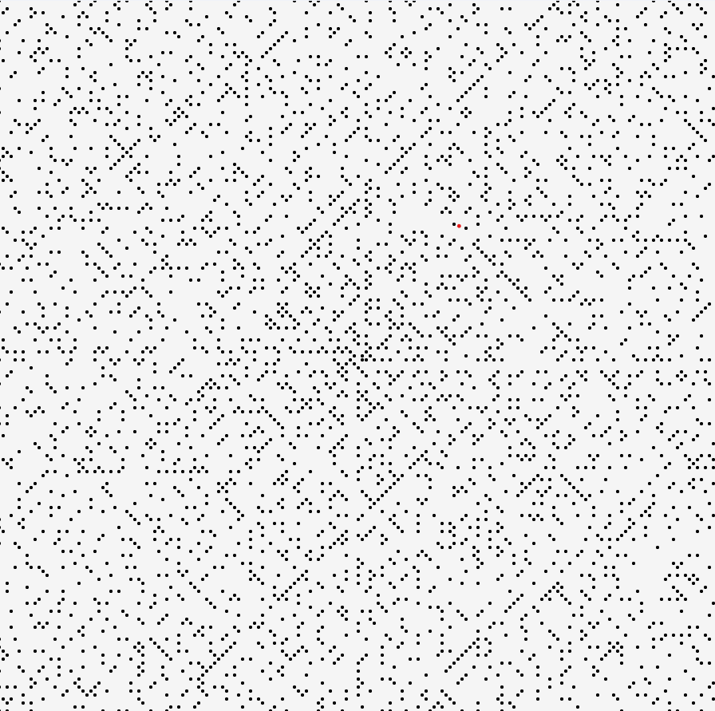

# Ulam Spiarl in Raylib - Tutorial



<br><br>

## Part - I - Code Layout


First we need to initialize our Raylib window. We can use the basic window template from [examples site](https://www.raylib.com/examples.html). To keep the main function clean i will initialize window in external function. I will also declare `screenWidth` and `screenHeight` as macros to access them more easily.

```c++
void Initialize(void){
    InitWindow(screenWidth, screenHeight, "Ulam Spiral");
    SetTargetFPS(30);  
}
```


<br><br>

After the window initialization design, we can focus on our spiral design.  In my case the spiral will be handled by __class__ called __Spiral__.


```c++
class Spiral{
    private:
        /* defined variables and help funcions */
    public:
        void GenerateSpiral(/* variables */);
        void DrawSpiral(void);
};
```
<br><br>

The `Spiral` class will have 2 functions:

<br>

```c++
void GenerateSpiral(/* variables */);
```

used to generate spiral


<br>


```c++
void DrawSpiral(void);
```
used to draw spiral


<br><br><br>

## Part - II - Spiral Class

To start programming our functions, we first need to recall __how Raylib displays pixels__.


There are two things to keep in mind:

1. Top left corner is $(0,0)$
2. y coordinate is flipped

<br>
This informations will be later important in programming functions.

<br><br><br>


### GenerateSpiral Function Programming


First let's look at the Ulam spiral and its mathematical relations


<br><br>


Notice that each time we return to the vertical (or horizontal) line, its length is increased by 1 number.


```c++
class Spiral{
    private:


}
```